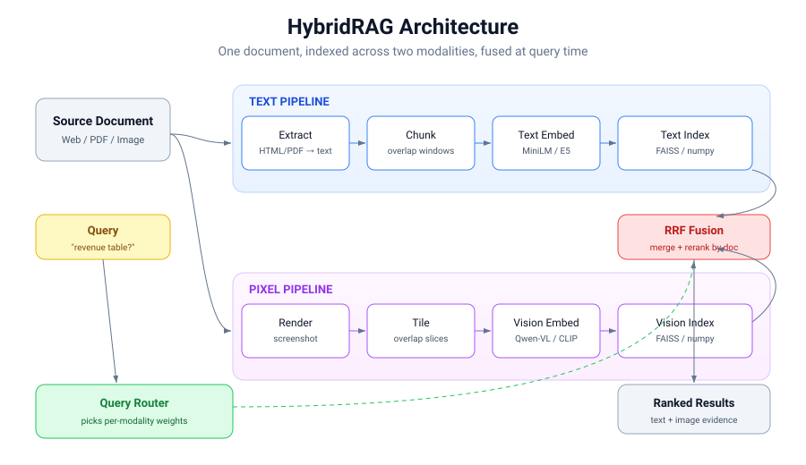
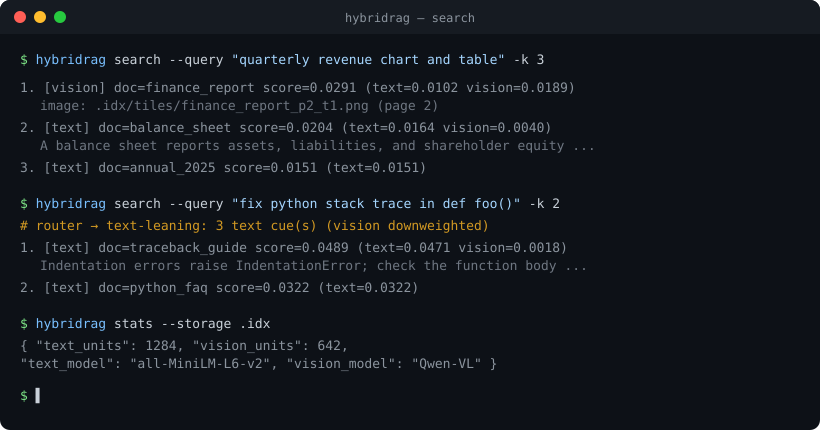
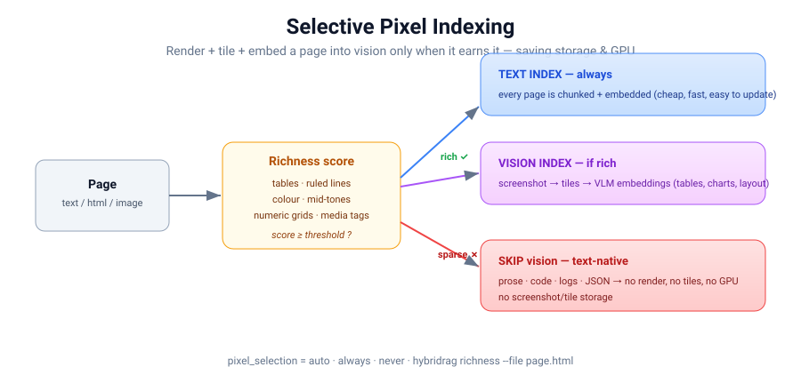

<div align="center">

# HybridRAG

**Search documents by what they _say_ and by how they _look_ — in one index.**

Text RAG is cheap, fast, and easy to update. Pixel RAG preserves tables, charts,
and layout. HybridRAG indexes **both** modalities, then **fuses** the results so
you get the strengths of each without committing to the weaknesses of either.

[Why Hybrid?](#why-hybrid) · [Architecture](#architecture) · [Quickstart](#quickstart) · [CLI](#cli) · [How it works](#how-it-works) · [Roadmap](#roadmap)

</div>

---

## Motivation

[Pixel RAG](https://github.com/StarTrail-org/PixelRAG) makes a compelling case:
render each page to a screenshot, slice it into tiles, embed the tiles with a
vision-language model (VLM), and retrieve visually. It never parses HTML, so it
keeps tables, charts, and complex layouts intact — and it rides the rapid
progress of VLMs like Qwen-VL.

That power comes with real costs:

| Pixel-only pain point | Why it hurts | How HybridRAG responds |
|---|---|---|
| **Storage** — screenshots + tiles + tile embeddings | 10M pages → tens/hundreds of TB | Text is cheap; store pixels only where they add value |
| **Slow indexing** — render → tile → VLM per page | Far longer than `HTML → chunk → embed` | Text path is fast; vision path runs in parallel and is optional per source |
| **Hard updates** — one line change re-screenshots the page | Text RAG updates a single chunk | Per-modality stores update independently |
| **GPU cost** — VLMs are heavy at index, rerank, and read | Expensive at scale | The **query router** skips vision when text suffices |
| **Text-native content** — code, logs, JSON | Vision is slower *and* worse here | Routed straight to the text index |
| **Lock-in to one VLM** | Whole system rebuilt if the model changes | Pluggable encoders behind a stable interface |

> The future isn't *only* text RAG, nor *only* pixel RAG — it's **hybrid**:
> extract the text, keep the image, search both, merge the results.
> That is exactly what HybridRAG implements.

## Why Hybrid

- **Recall where it counts.** A figure-only answer is found by pixels; a code
  snippet is found by text. Fusion surfaces a document that *either* modality
  ranks highly, and **reinforces** documents that *both* agree on.
- **Pay for vision only when it pays off.** The router reads the query and
  shifts weight toward text or pixels — code/log/JSON queries barely touch the
  GPU; "which chart shows…" leans visual.
- **No vendor lock-in.** Text and vision encoders sit behind small interfaces.
  Swap MiniLM for E5, or CLIP for Qwen-VL, without touching the pipeline.
- **Cheap to keep current.** Pixel RAG makes edits painful — change one line and
  you re-screenshot, re-tile, re-embed the page. HybridRAG keys every unit by
  `doc_id`, so `update`/`delete` re-embed only the document that changed and
  leave the rest of the index untouched.
- **Runs anywhere, immediately.** The core depends on **numpy only**. Deterministic
  fallback encoders let you try the full pipeline — ingest, fuse, serve — with
  zero model downloads, then opt into real models when you're ready.

## Architecture



A document flows down **two parallel pipelines**:

```
                         ┌───────────────────────────────────────────────┐
  Source (web/PDF/img) ──┤ TEXT:   extract → chunk → text-embed → index   │──┐
                         │ PIXEL:  render  → tile  → vision-embed → index │──┤
                         └───────────────────────────────────────────────┘  │
                                                                             ▼
        Query ──► Router (per-modality weights) ──► search both ──► Fusion (RRF/calibrated) ──► Rerank* ──► Reader* ──► Answer
                                                                  (*optional BM25/cross-encoder)  (*extractive / LLM-VLM)
```

## Quickstart

```bash
git clone https://github.com/Khalidabdi1/HybridRAG.git
cd HybridRAG
pip install -e .            # core only — numpy
python examples/quickstart.py
```

```python
from hybridrag import HybridConfig
from hybridrag.engine import HybridRAG

rag = HybridRAG(HybridConfig())

# Index text (chunked + embedded automatically)
rag.add_text("py", "Python is dynamically typed and garbage-collected ...", title="Python")
rag.add_text("fin", "The chart and table show quarterly revenue growth ...", title="Report")

# Search — both modalities are queried and fused
for hit in rag.search("how is python typed?", top_k=3):
    print(hit.doc_id, round(hit.score, 4), hit.components)

# Or get a grounded, *cited* answer in one call (the RAG "final readout").
# The default extractive reader runs on numpy alone and never hallucinates —
# every span comes from an indexed chunk, with a [n] citation.
ans = rag.answer("how is python typed?")
print(ans.formatted())
#  Python is dynamically typed and garbage-collected ... [1]
#
#  Sources:
#    [1] (text) doc=py — Python is dynamically typed and garbage-collected ...
```

The same `rag` can index image tiles too:

```python
from hybridrag.pipeline.render import tile_image      # needs: pip install -e ".[render]"

tiles = tile_image("page.png", doc_id="report", out_dir=".idx/tiles")
rag.add_tiles(tiles)
```

### Installing real models (optional extras)

```bash
pip install -e ".[text]"     # sentence-transformers (real text embeddings)
pip install -e ".[vision]"   # torch + transformers (CLIP / Qwen-VL style VLM)
pip install -e ".[render]"   # playwright + pymupdf (screenshots, PDF rendering)
pip install -e ".[serve]"    # FastAPI search server
pip install -e ".[faiss]"    # FAISS-backed vector store
pip install -e ".[all]"      # everything
```

Then point the config at real models:

```python
cfg = HybridConfig(
    text_model="sentence-transformers/all-MiniLM-L6-v2",
    vision_model="openai/clip-vit-base-patch32",   # CLIP-style dual-head VLM
)
rag = HybridRAG(cfg)
```

Or a **Qwen2-VL embedding model** (the GME family) — the same retrieval backbone
pixel-only systems use. The backend is picked automatically from the model id
(any id mentioning `qwen`/`gme` → the Qwen-VL adapter), and tiles/queries are
encoded in GPU mini-batches to bound memory on large pages:

```python
cfg = HybridConfig(
    vision_model="Alibaba-NLP/gme-Qwen2-VL-2B-Instruct",  # → QwenVLEmbedder (auto)
    vision_batch_size=8,                                   # tiles/queries per GPU batch
    vision_query_instruction="Find a document page that answers the query.",
    # vision_backend="qwen",  # force the backend if the id doesn't signal it
)
rag = HybridRAG(cfg)
```

## CLI



```bash
# Index raw text / a file
hybridrag add-text   --storage .idx --id readme --file README.md --title Readme

# Screenshot + tile a web page (needs [render])
hybridrag ingest-url --storage .idx --id wiki --url https://en.wikipedia.org/wiki/RAG

# Extract text AND render+tile a PDF (both modalities). Visually rich pages are
# indexed into the pixel store; text-native pages stay text-only (saves storage+GPU).
hybridrag ingest-pdf --storage .idx --id paper --pdf paper.pdf
hybridrag ingest-pdf --storage .idx --id paper --pdf paper.pdf --vision-selection always

# Batch-ingest a whole corpus from a manifest (JSON array or JSONL). Chunks are
# embedded in batches while documents are prepared on worker threads — the fast
# path for large corpora (addresses the "indexing is slow" cost of pixel RAG).
hybridrag ingest-batch --storage .idx --manifest corpus.jsonl --batch-size 128 --workers 4
#   {"doc_id": "a", "text": "..."}                         # one object per line
#   {"doc_id": "b", "html": "<table>...</table>", "image_paths": ["b.png"]}

# Inspect the selective-indexing decision for a page (no index needed)
hybridrag richness   --file page.html        #  -> INDEX or SKIP pixels + why

# Analyse rendered tiles for content duplicates (repeated headers/footers/logos)
# and see the storage + GPU a dedup would save — before you embed anything.
hybridrag dedup      --dir .idx/tiles        #  -> "1200 tiles -> 340 unique (72% saved)"

# Inspect / train the query router (per-query text vs vision weighting)
hybridrag route      --query "which chart shows revenue" --model learned  # -> weights + P(vision)
hybridrag train-router --examples queries.jsonl --out router.json         # fit on your query logs

# Search (fused). Force a single modality with --modality text|vision
hybridrag search     --storage .idx --query "quarterly revenue table" -k 5

# Answer a question — retrieve AND synthesize a grounded, cited answer
hybridrag answer     --storage .idx --query "what was Q3 revenue?"
#  Quarterly revenue grew to 4.2 billion dollars on strong cloud demand. [1]
#  Sources:
#    [1] (text) doc=report p.3 — Quarterly revenue grew to 4.2 billion dollars ...
hybridrag stats      --storage .idx

# Incremental updates — re-embed only the doc that changed, not the corpus
hybridrag add-text   --storage .idx --id readme --file README.md --replace
hybridrag delete     --storage .idx --id readme
hybridrag list-docs  --storage .idx

# Serve a search API (needs [serve])
hybridrag serve      --storage .idx --port 8000
#  GET /search?q=...&k=5   ·   POST /search {"query": "...", "top_k": 5}

# Benchmark text-only vs vision-only vs hybrid on a dataset
hybridrag eval       --dataset examples/datasets/sample.json -k 1,5,10

# Model storage + $/query cost per modality and project it to N pages
hybridrag cost       --storage .idx --project-pages 10000000
```

## Use with Claude (MCP + Skill)

HybridRAG ships an [MCP](https://modelcontextprotocol.io) server so Claude Code,
Claude Desktop, or the Claude Agent SDK can index and search documents *during a
conversation* — and a [Claude skill](.claude/skills/hybridrag/SKILL.md) that
teaches Claude when and how to use it.

```bash
pip install -e ".[mcp]"        # installs the `mcp` runtime
hybridrag-mcp                  # or: python -m hybridrag.mcp_server
```

The repo includes a project-scoped [`.mcp.json`](.mcp.json), so inside this
directory Claude Code discovers the server automatically. To register it
elsewhere:

```bash
claude mcp add hybridrag -- python -m hybridrag.mcp_server
```

The server exposes these tools over a persistent index (set by
`$HYBRIDRAG_STORAGE`, default `.hybridrag_index`):

| Tool | Purpose |
| --- | --- |
| `hybridrag_search` | Fused text+pixel search; force a modality with `modality`. |
| `hybridrag_answer` | Retrieve **and** synthesize a grounded, cited answer (no hallucination; figures returned as `visual_evidence`). |
| `hybridrag_add_text` | Chunk and index a raw text document. |
| `hybridrag_add_html` | Extract text from HTML, then chunk and index it. |
| `hybridrag_add_batch` | Index many documents in one batched call — the fast path for a corpus. |
| `hybridrag_update_text` | Replace a document in place — re-embed only that `doc_id`. |
| `hybridrag_delete` | Remove every unit belonging to a `doc_id`. |
| `hybridrag_list_docs` | List the distinct document ids in the index. |
| `hybridrag_stats` | Report document count, index size, models, and dimensions. |
| `hybridrag_cost` | Model storage + $/query per modality and project it to N pages. |
| `hybridrag_richness` | Score a page's visual richness and decide if it earns the pixel path. |
| `hybridrag_route` | Explain how the router splits a query across text/vision (with the learned `P(vision)`), without searching. |
| `hybridrag_dedup` | Analyse tile images for content duplicates; report unique vs duplicate tiles and the storage/GPU a dedup saves. |

The bundled **skill** (`.claude/skills/hybridrag/`) is picked up automatically by
Claude Code in this repo; it tells Claude to prefer text-only retrieval for code,
logs, and JSON, and to blend in pixels for tables, charts, and complex layouts.

## Evaluation

The whole HybridRAG thesis is empirical: *does* fusing pixels with text help, and
what does it cost? The built-in harness answers that on **your** corpus with
standard ranking metrics (recall@k, precision@k, nDCG@k, hit@k, MRR), measured
latency, and the index footprint — for each modality side by side.

```bash
hybridrag eval                 # runs the built-in offline sample
```

```
Dataset: hybridrag-sample   metrics @k=10   (text_units=12, vision_units=0)
mode    recall  prec   nDCG   hit    MRR    ms/q  units
------  ------  -----  -----  -----  -----  ----  -----
text    0.917   0.092  0.804  0.917  0.767  0.10  12
vision  0.000   0.000  0.000  0.000  0.000  0.00  0
hybrid  0.917   0.092  0.804  0.917  0.767  0.10  12
  note[vision]: no indexed units for this modality — skipped
```

The built-in sample is intentionally **text-only** so it runs with numpy alone —
it measures a lexical baseline and proves the harness end to end. To get a real
three-way comparison, point it at a dataset with `image_path` documents and turn
on real encoders:

```bash
hybridrag eval --dataset my_corpus.json \
  --text-model sentence-transformers/all-MiniLM-L6-v2 \
  --vision-model openai/clip-vit-base-patch32 \
  -k 1,5,10 --json
```

Datasets are plain JSON — a corpus plus relevance judgements (`qrels`):

```json
{
  "name": "my_corpus",
  "documents": [
    {"doc_id": "d1", "text": "Python raises ZeroDivisionError when ..."},
    {"doc_id": "d2", "image_path": "tiles/revenue_chart.png"}
  ],
  "queries": [
    {"id": "q1", "query": "divide by zero error", "relevant": {"d1": 1.0}},
    {"id": "q2", "query": "quarterly revenue chart", "relevant": ["d2"]}
  ]
}
```

Relevance may be binary (`["d2"]`) or graded (`{"d1": 2.0, "d2": 1.0}`, used by
nDCG). The same API is available in Python:

```python
from hybridrag.eval import evaluate, build_engine, EvalDataset

ds = EvalDataset.from_file("my_corpus.json")
report = evaluate(build_engine(ds), ds.queries, ks=(1, 5, 10))
print(report.table())
```

### Cost & storage model

Ranking metrics tell you whether pixels *help*; the cost model tells you what
they *cost*. It measures vector bytes exactly from the index and models raw
artifact bytes (screenshots, tile crops, stored text), one-time indexing $, and
$/query from a transparent `CostModel` of unit prices you can override with your
provider's real numbers. It then **projects** storage to any corpus size — the
direct answer to *"10 million pages, how many terabytes is that?"*

```bash
hybridrag cost --project-pages 10000000          # or: hybridrag eval --cost
```

```
Cost model — dataset: hybridrag-sample  (text_units=12, vision_units=0)
mode    vectors  artifacts  total    $/mo (store)  $/index    $/query
------  -------  ---------  -------  ------------  ---------  ---------
text    18.0 KB  12.0 KB    30.0 KB  $6.58e-07     $1.20e-06  $2.00e-06
vision  0 B      0 B        0 B      $0            $0         $4.00e-04
hybrid  18.0 KB  12.0 KB    30.0 KB  $6.58e-07     $1.20e-06  $4.02e-04

Storage projection — 10,000,000 pages
mode    bytes/page  total    $/mo (store)
------  ----------  -------  ------------
text    7.5 KB      71.5 GB  $1.65
vision  628.0 KB    5.8 TB   $137.75
hybrid  635.5 KB    5.9 TB   $139.39
  vision/text storage ratio: 84x
```

At ten million pages, a pixel-only index is **~84× larger** than a text index
(terabytes vs gigabytes) and ~200× more expensive to embed and to query — which
is exactly why HybridRAG keeps text as the cheap default and spends vision only
where layout actually matters. Override any price with a JSON file:

```bash
echo '{"storage_usd_per_gb_month": 0.10, "vision_embed_usd_per_1k_units": 0.05}' > prices.json
hybridrag cost --cost-model prices.json --project-pages 10000000
```

```python
from hybridrag.eval import estimate_cost, CostModel, build_engine, sample_dataset

report = estimate_cost(build_engine(sample_dataset()), CostModel())
print(report.table())
print(report.projection_table(pages=10_000_000))
```

## How it works

### 1. Two stores, one engine
`HybridRAG` keeps a `VectorStore` per modality (numpy by default, FAISS optional).
They are populated and **updated independently** — re-embedding a changed text
chunk never touches the pixel index, and vice versa.

### 2. The query router
Before searching, [`retrieve/router.py`](src/hybridrag/retrieve/router.py) reads
the query and returns per-modality weights. It never hard-disables a modality
(recall is preserved); it shifts emphasis so you don't pay GPU cost for a query
that text answers better. Two routers ship, chosen with `router_model`:

- **`heuristic`** (default) — hand-tuned keyword rules. `code`, `stack trace`,
  `json`, `{ } ;` lean **text**; `chart`, `table`, `diagram`, `layout` lean
  **vision**.
- **`learned`** — a tiny **logistic-regression classifier** (numpy only) over
  interpretable query features (text/vision cue densities, code structure,
  numeric density, length). It ships **pre-trained** on an embedded seed set so
  it works out of the box and outputs a calibrated `P(vision-relevant)` per
  query. Because the *combination* of signals is learned rather than hard-coded,
  you can **retrain it on your own query logs** — the whole point of a learned
  router over fixed constants:

  ```bash
  hybridrag route --query "which chart shows the revenue table" --model learned
  #  [learned] text_weight=0.364  vision_weight=1.636
  #    learned: vision-leaning (p=0.95)

  # fit on labelled queries ({query, label} where label = P(vision) in 0..1)
  hybridrag train-router --examples queries.jsonl --out router.json
  # then point the index at it: router_model="learned", router_weights_path="router.json"
  ```

  Training is deterministic (zero-init, full-batch gradient descent), so the
  shipped weights are reproducible and every test runs on numpy alone.

### 3. Fusion (RRF or score-calibrated)
Cosine scores from a text encoder and a vision encoder are **not** comparable, so
the default fusion in [`retrieve/fusion.py`](src/hybridrag/retrieve/fusion.py)
fuses by *rank*, not raw score — **Reciprocal Rank Fusion**: each list
contributes `weight / (k + rank)` per document. Results are grouped by `doc_id`,
so a document found by **both** modalities is reinforced, and every hit reports
its per-modality `components` for transparency.

RRF is robust but throws away *confidence*: a near-perfect top hit and a mediocre
one an adjacent rank apart contribute almost the same. When your score
distributions are informative and roughly stationary, switch to
**score-calibrated fusion** (`fusion_method="calibrated"`, or `--fusion calibrated`
per query). It normalizes each modality's raw scores onto a common `[0, 1]` scale
(`fusion_norm`: `minmax` / `zscore` / `softmax`), then combines them — so a very
confident match outranks a lukewarm one and the *gap* between hits survives:

```text
query "revenue growth financial", 3 docs (relevant / off-topic / off-topic)
  RRF          d1=0.0167  d2=0.0164  d3=0.0161   ← rank-only: nearly tied
  calibrated   d1=1.0000  d2=0.1548  d3=0.0000   ← the real confidence gap
```

```bash
hybridrag search --storage idx --query "revenue growth financial" --fusion calibrated
```

### 4. Reranking (optional)
RRF fuses by *rank* and never reads the query and a document **together**, so it
can't separate a strong answer from a mediocre one at adjacent ranks. Turn on
reranking and the engine fuses a deeper candidate pool (`rerank_top_n`), then
[`retrieve/rerank.py`](src/hybridrag/retrieve/rerank.py) re-scores those
candidates against the query *jointly* — the cross-encoder idea, run only on the
small surviving set where it's affordable. The default `LexicalReranker` is a
dependency-free **BM25** scorer (IDF-weighted, length-normalized); set
`rerank_model` to a `sentence-transformers` `CrossEncoder` id for the real model.
The reranker score is blended with the fusion score (`rerank_blend`) and reported
under each hit's `components['rerank']`. Image-only tiles keep their fusion
standing rather than being demoted for having no text.

```bash
hybridrag search --storage idx --query "cloud revenue growth" --rerank
#  1. [text] doc=d1 score=1.0000 (text=0.0167 rerank=1.0000)   ← BM25 lifts the on-topic doc
#  2. [text] doc=d2 score=0.0000 (text=0.0164 rerank=0.0000)
```

### 5. Pluggable encoders
Everything implements `TextEmbedder` / `VisionEmbedder`
([`embed/base.py`](src/hybridrag/embed/base.py)). The default `hash` encoders are
deterministic and dependency-free (great for tests and demos); the real
`sentence-transformers` and VLM backends drop in by changing one config string.
Two vision backends ship: `VLMVisionEmbedder` for CLIP-style dual-head models
and `QwenVLEmbedder` for the Qwen2-VL / GME family, both subclassing
`BatchedVisionEmbedder` so image tiles and text queries are encoded in
`vision_batch_size` GPU mini-batches — batched output is identical, row-for-row,
to a single un-chunked call, so batching never changes results, only memory.
This is what keeps the design from locking into one VLM: swap CLIP for Qwen-VL
by changing `vision_model`, and the backend is selected automatically.

### 6. Selective pixel indexing (ingest-time)
Pixel RAG's two worst costs — **storage** and **GPU** — both scale with the
number of pages you push through the vision pipeline. But a page of prose, a code
listing, or a JSON dump gains nothing from a screenshot: the text index already
covers it. [`pipeline/select.py`](src/hybridrag/pipeline/select.py) scores how
*visually rich* a page is and indexes pixels only when it's worth it:



- **Pre-render signal** (cheapest) — `score_text_richness(text, html)` reads the
  extracted text/HTML *before* anything is rendered, looking for tabular rows,
  numeric grids, column alignment, and media tags (`<table>`, `<svg>`,
  `<canvas>`, ``, `<figure>`, `chart`). A low score skips rendering entirely.
- **Image signal** — `score_image_richness(image)` reads a rendered page (numpy
  array / PIL image / PNG path) and measures ruled-line density (tables), colour
  saturation (charts/figures), and mid-tone density (photos) — the cues that
  survive *only* in pixels.

The policy is one config knob: `pixel_selection` = `"auto"` (score it),
`"always"` (classic Pixel RAG), or `"never"` (text-only), with
`pixel_selection_threshold`. `ingest-pdf` / `ingest-url` consult it per page; the
engine exposes `should_index_pixels(text=, html=, image=)`; and you can inspect
any page's verdict directly:

```bash
hybridrag richness --text "def foo(): return 1"       # SKIP pixels (score≈0.05) — code is text-native
hybridrag richness --file quarterly_report.html       # INDEX pixels (score≈0.95) — it's a table
```

### 7. Tile deduplication (storage + GPU)
Selective indexing decides *whether* a page earns the pixel path; deduplication
attacks the pages that do. Tile a real document and a large fraction of the tiles
are **byte-for-byte identical** — the running header, footer, logo band, or blank
margin that repeats on every one of its pages. A 200-page report tiles into ~200
copies of the same header, and embedding + storing each one is pure waste.
[`pipeline/dedup.py`](src/hybridrag/pipeline/dedup.py) collapses them:

- **Embed once, cite everywhere.** `TileDeduplicator` content-hashes each tile
  and keeps a single representative per group; every other occurrence is recorded
  on it as `meta["occurrences"]`, so a hit still resolves to *every* page the
  tile appears on. One embedding and one stored record per unique tile → less
  vector + artifact storage (disadvantage #1) and fewer VLM forward passes
  (disadvantage #4).
- **Deletes stay correct.** Scope is per-`doc_id` by default, so a representative
  is never shared across documents and `delete(doc_id)` compacts cleanly. Flip to
  `tile_dedup="global"` to also fold identical tiles *across* documents (shared
  brand logos) when you don't delete individual docs.
- **Exact or perceptual.** `"exact"` (default) SHA-256s the tile bytes — no
  dependencies. `"ahash"` folds visually-identical but byte-different copies
  (re-encoded PNGs, format changes) via an 8×8 average hash.

It's on by default (`tile_dedup="doc"`) and runs inside `add_tiles`, so batched
ingestion and every render path benefit for free; non-duplicated tiles pass
through untouched. Estimate the win on already-rendered tiles first:

```bash
hybridrag dedup --dir .idx/tiles
#  1200 tile(s) -> 340 unique (860 duplicate, 71.7% saved) across 6 repeated group(s)
#    method=exact scope=doc  est. artifact storage saved ~168.0 MB
```

### 8. Answer synthesis (the "final readout")
Retrieval returns passages; a RAG system has to *read* them and answer. In Pixel
RAG that readout always means a VLM call over screenshots — the single most
expensive step. HybridRAG makes the readout a **pluggable** step with a cheap,
honest default ([`synth/reader.py`](src/hybridrag/synth/reader.py)):

- **`ExtractiveReader`** (default, **numpy alone**) — ranks the sentences inside
  the retrieved chunks by BM25 against the query, stitches the best few into a
  short answer, and attaches a `[n]` citation to each. Because every span is
  copied verbatim from an indexed chunk, there is *nothing to hallucinate*.
  Relevant tables/charts that carry no readable text come back as
  `visual_evidence` so the caller can still surface the figure.
- **`LLMReader`** (opt-in) — wrap any `generate(prompt, image_paths) -> str`
  callable (Claude, Qwen-VL, a local model). It builds a grounded,
  citation-instructed prompt from the top text chunks **and** passes the top tile
  images through for a VLM to read — but only ever for the handful of fused hits,
  so the heavy model's cost stays bounded.

```python
ans = rag.answer("what was Q3 revenue?")          # default: extractive, cited, free
print(ans.text)        #  "Quarterly revenue grew to 4.2 billion dollars ... [1]"
print(ans.citations)   #  [Citation(marker=1, doc_id='report', page=3, ...)]

# Or hand in a real model for generated synthesis over the same hits:
from hybridrag.synth import LLMReader
def claude(prompt, image_paths): ...               # your Claude/Qwen-VL call
ans = rag.answer("summarise the revenue chart", reader=LLMReader(claude))
```

```bash
hybridrag answer --storage .idx --query "what was Q3 revenue?"
```

### 9. Batched ingestion (large corpora)
Indexing is Pixel/Hybrid RAG's slowest phase: every page is extracted, chunked,
optionally rendered + tiled, then embedded. The naive path embeds **one document
at a time** — an `encode()` call per document — which throws away a real
encoder's throughput, since a GPU model amortizes almost all of its cost over the
batch. [`BatchIngestor`](src/hybridrag/pipeline/ingest.py) fixes both halves:

- **Batched embedding.** Prepared chunks and tiles are buffered *across*
  documents and flushed to the store in fixed-size batches, so each `encode()`
  sees `batch_size` units — the exact shape a batched GPU encoder wants.
- **Parallel preparation.** Per-document prep (HTML→text, chunking, tiling
  metadata, the selective-pixel decision) runs on a small thread pool, so the
  next document is prepared while the current batch embeds. Store writes stay
  single-threaded and in input order, so the result is **byte-for-byte identical**
  to serial ingestion — just faster.

```python
stats = rag.add_documents(
    [{"doc_id": "a", "text": "..."},
     {"doc_id": "b", "html": "<table>...</table>", "image_paths": ["b.png"]}],
    batch_size=128, max_workers=4, upsert=False,
)
print(stats.to_dict())   # documents, chunks_added, tiles_added, text_batches, docs_per_second
rag.save()               # persist once, not per document
```

The same path is exposed as `hybridrag ingest-batch --manifest ...` and the
`hybridrag_add_batch` MCP tool. Selective pixel indexing still applies per
document, so text-native pages in the corpus never pay the vision cost.

## Project layout

```
src/hybridrag/
├── engine.py           # HybridRAG: ingest + search + persistence
├── config.py           # HybridConfig (all knobs, JSON-serializable)
├── types.py            # Chunk, Tile, Document, SearchResult, Modality
├── embed/              # text & vision encoders (+ hashing fallback)
├── index/              # VectorStore (numpy / FAISS)
├── pipeline/           # extract (HTML/PDF→text, chunk) + render (screenshot, tile) + select (selective pixel indexing) + dedup (tile deduplication) + ingest (batched/parallel)
├── retrieve/           # router (per-query weights) + fusion (RRF/calibrated) + rerank (BM25/cross-encoder)
├── synth/              # answer synthesis: extractive (no deps) + LLM/VLM reader (the "final readout")
├── eval/               # metrics, datasets, harness, cost model (text vs vision vs hybrid)
├── serve/              # FastAPI search API
├── mcp_server.py       # MCP server for Claude (`hybridrag-mcp`)
└── cli.py              # `hybridrag` command
.claude/skills/hybridrag/  # Claude skill describing the engine
.mcp.json               # project-scoped MCP server registration
tests/                  # pytest suite (runs on numpy alone)
examples/quickstart.py  # end-to-end demo
examples/datasets/      # sample evaluation dataset (JSON)
```

## Development

```bash
pip install -e ".[dev]"
pytest -q          # full suite runs without any model downloads
ruff check .
```

## Roadmap

See [ROADMAP.md](ROADMAP.md). Near-term: benchmarks & screenshots from a real
corpus. The [learned query router](#2-the-query-router) — a numpy
logistic-regression classifier over query features, retrainable on your own
query logs — landed in v0.11. The [Qwen-VL embedding adapter with batched
GPU inference](#5-pluggable-encoders) — a `QwenVLEmbedder` for the Qwen2-VL / GME
family plus a `BatchedVisionEmbedder` base shared by both vision backends —
landed in v0.10. [Batched ingestion](#8-batched-ingestion-large-corpora) —
buffer-and-batch embedding with parallel document prep — landed in v0.9.
[Answer synthesis](#7-answer-synthesis-the-final-readout)
— a grounded, cited readout with a dependency-free extractive default and a
pluggable LLM/VLM reader — landed in v0.8. [Selective pixel
indexing](#6-selective-pixel-indexing-ingest-time) — index pixels only for
visually rich pages — landed in v0.7; [cross-encoder reranking](#4-reranking-optional)
of fused results in v0.6. The [cost & storage model](#cost--storage-model)
($/query + at-scale storage projection) landed in v0.5. Incremental
updates/deletes keyed by `doc_id` landed in v0.4. The [MCP server + Claude
skill](#use-with-claude-mcp--skill) landed in v0.3; the [evaluation
harness](#evaluation) (text-only / pixel-only / hybrid on one corpus) landed in
v0.2.

## Acknowledgements

Inspired by [PixelRAG](https://github.com/StarTrail-org/PixelRAG) by StarTrail —
HybridRAG keeps its visual insight and pairs it with classic text retrieval.

## License

[MIT](LICENSE)
